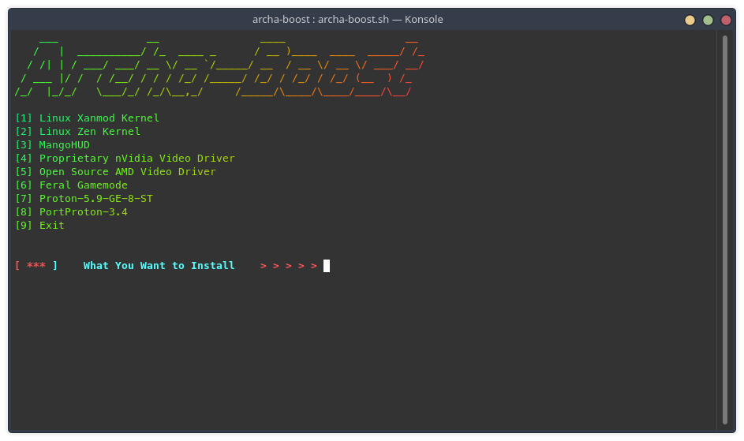

# archa-boost
**ArchLinux and Manjaro gaming optimizer.**

<p align="center">
<a href="https://github.com/OneParsec/archa-boost/releases"></a>
<a href="https://github.com/OneParsec/archa-boost/blob/main/LICENSE"></a>
</p>

**Need figlet and lolcat**

```sudo pacman -S figlet lolcat```

# How to use
```
$ git clone https://github.com/OneParsec/archa-boost
$ cd archa-boost
$ chmod +x archa-boost.sh
$ ./archa-boost
```
**Screenshot**

